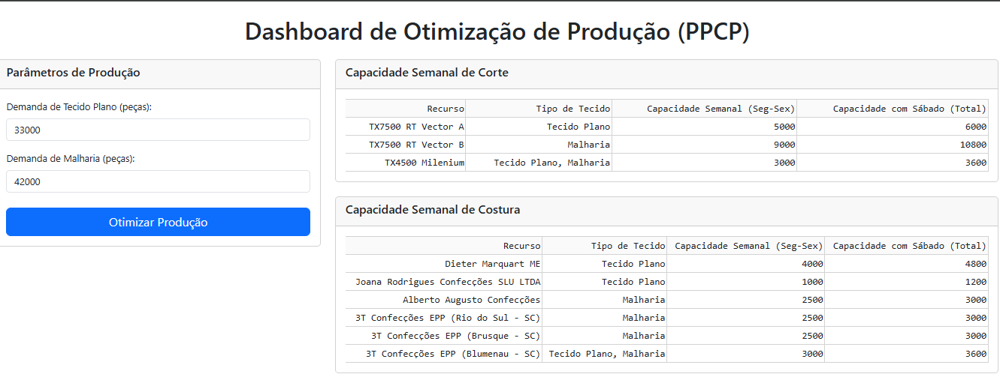
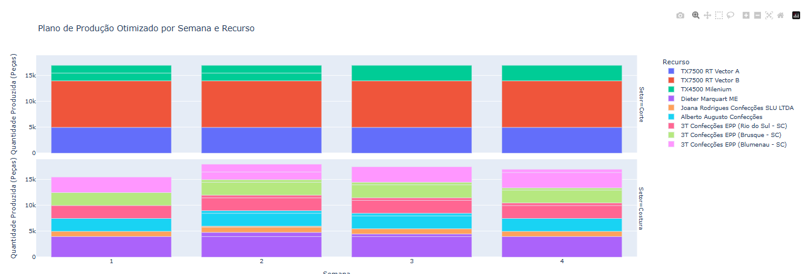
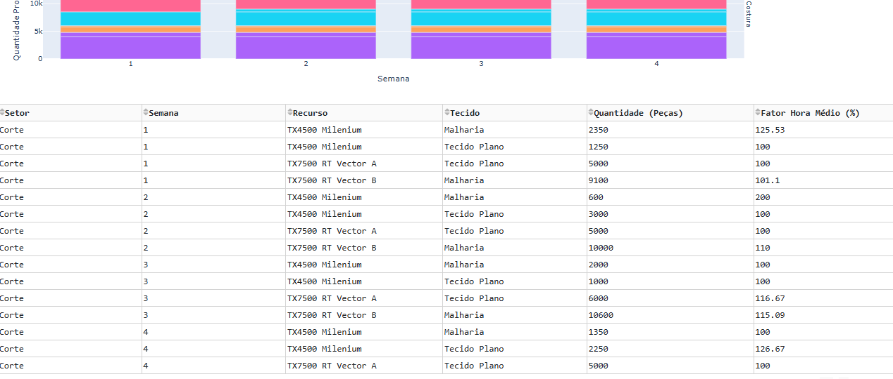
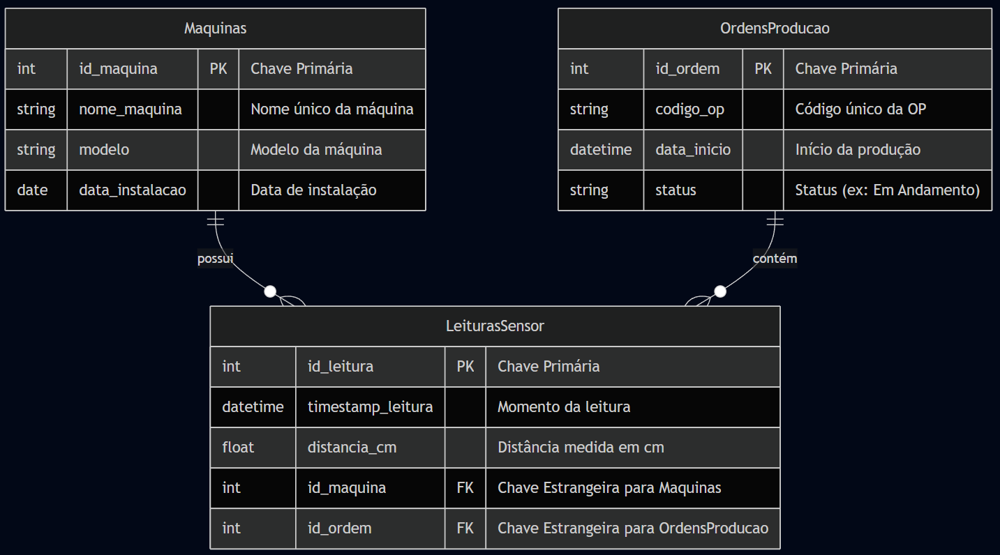

# Sistema Inteligente de Monitoramento e Otimização de Produção Têxtil

## Grupo: 39

### 👨‍💻 Integrantes:
* Thiago Scutari - RM562831 | [thiago.scutari@outlook.com](mailto:thiago.scutari@outlook.com)
* Henrique Ribeiro Siqueira - RM565044 | [henrique.ribeiro1201@gmail.com](mailto:henrique.ribeiro1201@gmail.com)
* Mariana Cavalante Oliveira - RM561678 | [mari.kvalcant@gmail.com](mailto:mari.kvalcant@gmail.com)

### 👩‍🏫 Professores:
* Leonardo Ruiz Orabona
* Andre Godoi Chiovato

---

## 🎥 Demonstração em Vídeo

Assista a uma demonstração completa do projeto, desde a captura de dados do sensor até a utilização do dashboard de otimização de produção.

**[Clique aqui para ver o vídeo no YouTube](https://youtu.be/Im8_M_dCf0Q)**

---

## 📖 Visão Geral do Projeto

Projeto completo que integra um sistema de monitoramento de **folhas de tecido (enfesto)** via IoT e uma ferramenta de **otimização de produção (PPCP)** com Inteligência Artificial.

---

## 🎯 Objetivo

O projeto possui dois objetivos centrais:
1.  **Monitorar:** Simular um processo industrial de enfesto, onde um sensor ultrassônico captura dados em tempo real para monitoramento da produção, armazenando-os em um banco de dados relacional.
2.  **Otimizar:** Resolver um problema complexo de planejamento de produção utilizando Programação Linear para encontrar o plano de menor custo operacional, apresentando a solução em um dashboard web interativo.

---

## 🛠️ Componentes do Projeto

- **Hardware Simulado (Wokwi):**
  - ESP32 com Sensor Ultrassônico (HC-SR04).
- **Linguagem e Bibliotecas Principais (Python):**
  - `pyserial`: para comunicação com o sensor.
  - `sqlite3`: para gerenciamento do banco de dados.
  - `pandas`: para análise e manipulação dos dados.
  - `pulp`: para o modelo de otimização (Programação Linear).
  - `dash` e `plotly`: para a criação do dashboard web interativo.
- **Banco de Dados:**
  - SQLite com um esquema relacional normalizado.
- **Interfaces:**
  - **Dashboard Web:** Interface principal para a otimização de PPCP.
  - **CLI (Command Line Interface):** Interface secundária para análise de dados do sensor.








---

## 🔩 Modelagem do Banco de Dados

Para esta entrega, o banco de dados foi reestruturado para um modelo relacional, garantindo a integridade e eliminando redundâncias.



---

## 🚀 Instalação e Execução

### Instalação

```bash
# Clone o repositório
git clone [https://github.com/ThiagoScutari/sprint_2.git](https://github.com/ThiagoScutari/sprint_3.git)
cd sprint_2/python

# Crie e ative um ambiente virtual
# Windows
python -m venv venv
.\\venv\\Scripts\\activate

# macOS / Linux
# python3 -m venv venv
# source venv/bin/activate

# Instale as dependências
pip install -r requirements.txt
```

### Execução

O projeto possui dois componentes executáveis principais.

#### 1. Dashboard de Otimização de Produção (Entrega Principal)

Para iniciar o servidor web e acessar o dashboard, execute:
```bash
python src/ml_model.py
```
Abra seu navegador no endereço fornecido (geralmente `http://127.0.0.1:8050/`).

#### 2. Monitoramento de Sensor (Coleta de Dados)

**Passo 1:** Inicie a simulação do ESP32 no Wokwi.

**Passo 2:** Para capturar os dados do sensor e salvá-los no banco, execute:
```bash
python src/monitorar_sensor.py
```
Pressione `Ctrl+C` para parar a coleta.